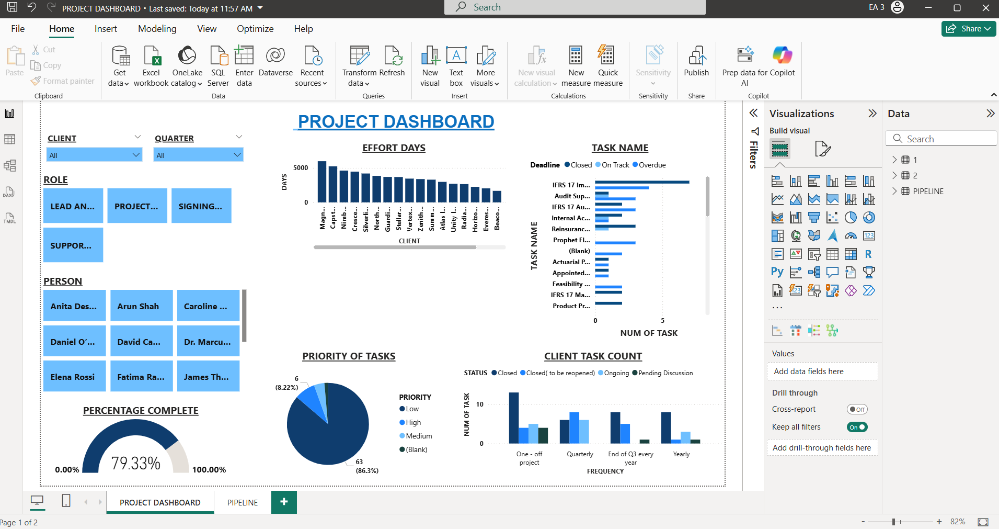
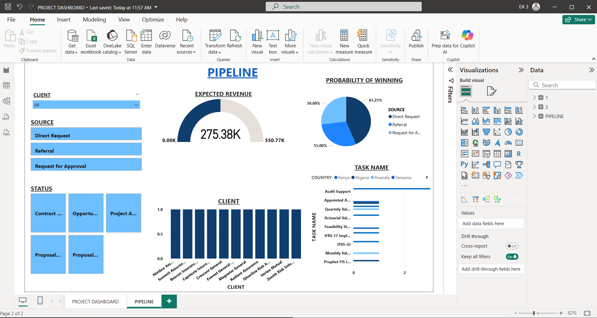

# Workflow Dashboard in Power BI 

**Tools:** Power BI, Excel (dummy dataset)

This dashboard replicates a project automation tool created during my internship.  
The visuals here are powered by a synthetic dataset of  workflow tasks across departments (Claims, Underwriting, Finance, IT, Actuarial).

**Dashboard features:**
-Dynamic Filters – Slice data by Client, Quarter, Role, and Person for detailed analysis.
-Effort & Task Tracking – Breakdown of effort days by client and task status (Closed, On Track, Overdue).
-Progress & Priority Insights – Completion percentage gauge and priority distribution (High, Medium, Low).
-Opportunity Pipeline View – Full visibility of active, upcoming, and potential projects.
-Stage & Conversion Monitoring – Track progression across pipeline stages to identify bottlenecks.
-Client & Value Distribution – Analyze pipeline value per client and spot top revenue contributors.

**Deliverables:**
- `PROJECT_DASHBOARD.pbix` — Power BI file
- `screenshots/` — PNGs and PDF export for quick viewing without Power BI

⚠️ Note: This demo uses anonymised data. Original dashboard used confidential datasets.

