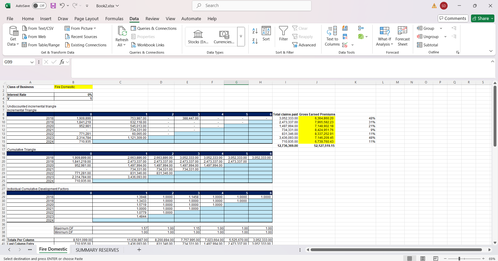
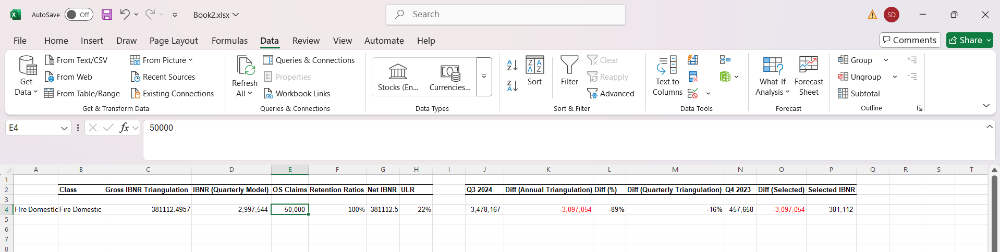

# IBNR Reserving in Excel  
**Tools:** Excel (formulas, pivot tables, actuarial reserving techniques)  

This project demonstrates an **Incurred But Not Reported (IBNR) reserving model** applied on a synthetic dataset of insurance claims.  
The methodology reflects industry-standard actuarial reserving practices, while all identifiers and claim data have been anonymised.  

### What the file includes:
- Claims development triangle (accident vs. development years)  
- Link ratio / development factor calculations  
- Chain-ladder projections of ultimate claims  
- IBNR reserve estimation as ultimate – reported  

### Deliverables:
- `01_IBNR_Reserving_Excel.xlsx` — Excel workbook with all calculations  

⚠️ **Note:** This demo uses anonymised structures inspired by real reserving workflows. Original client datasets remain confidential.  

  
  
