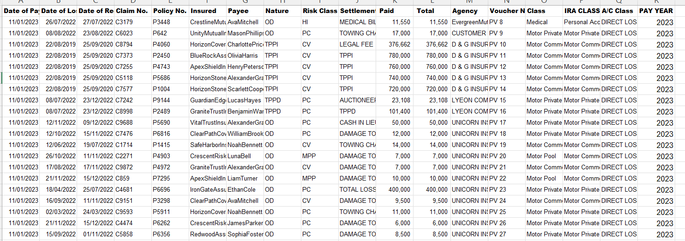
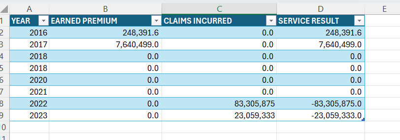
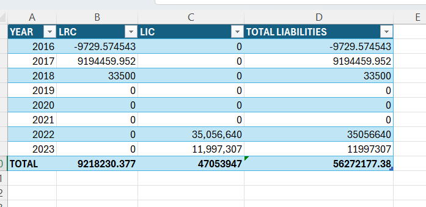
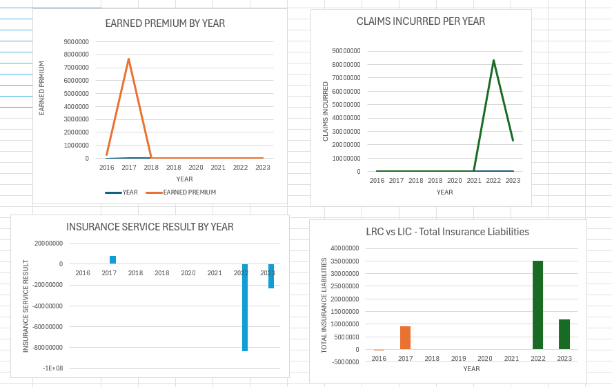

# IFRS 17 Implementation

**Tools:** Excel (formulas, pivot tables, charts)

This project demonstrates a simplified IFRS 17 (PAA) implementation using insurance premium and claims data.  
The model shows how Unearned Premium Reserves (UPR) translate into Earned Premium, and how Claims Paid and Outstanding Claims (OS) roll forward into Incurred Claims and Insurance Liabilities.  

**What the file includes:**
- Premiums sheet: UPR calculation and Earned Premium by policy/year
- Claims Paid & Claims OS sheets: pivot tables to summarise raw claims
- Claims sheet: roll-forward of Outstanding Claims (OS_begin → OS_end)
- P&L: Earned Premium, Claims Incurred, Insurance Service Result
- Balance Sheet: Liability for Remaining Coverage (LRC = UPR) and Liability for Incurred Claims (LIC = OS_end)
- Charts: visuals of Earned Premium, Claims Incurred, Service Result, and Liabilities

**Deliverables:**
- `IFRS17_Implementation.xlsx` — Excel model with all calculations and outputs

⚠️ Note: This demo uses anonymised, non-confidential data structures. Premiums were available for 2016–2017, while claims data covered 2022–2023. The purpose is to demonstrate IFRS 17 mechanics, not produce business-ready results.

  
   
 
  
